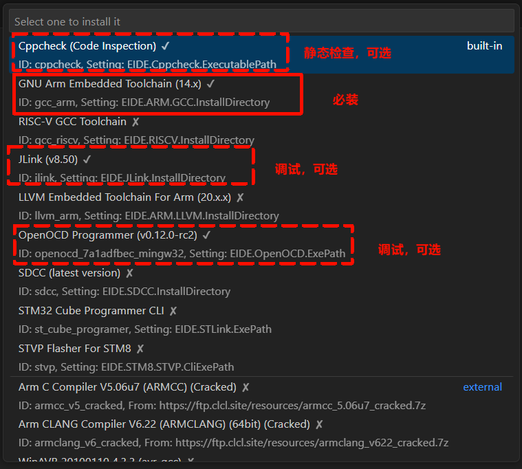
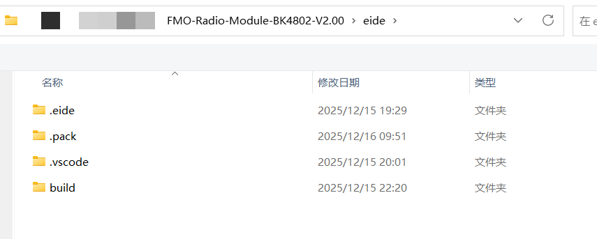
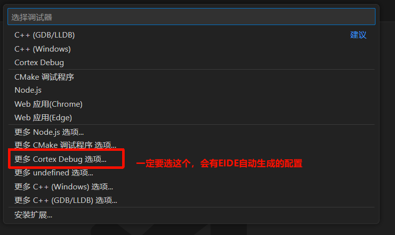
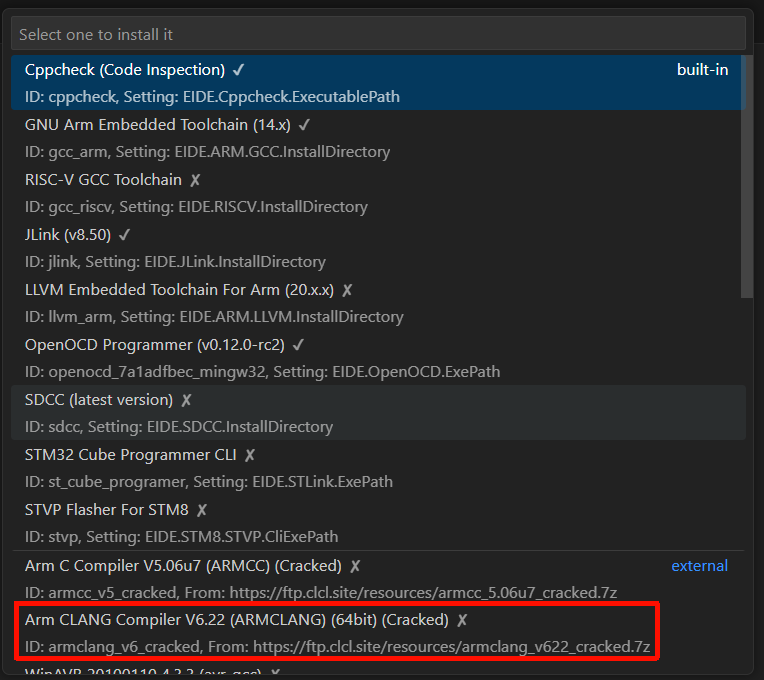
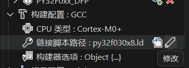
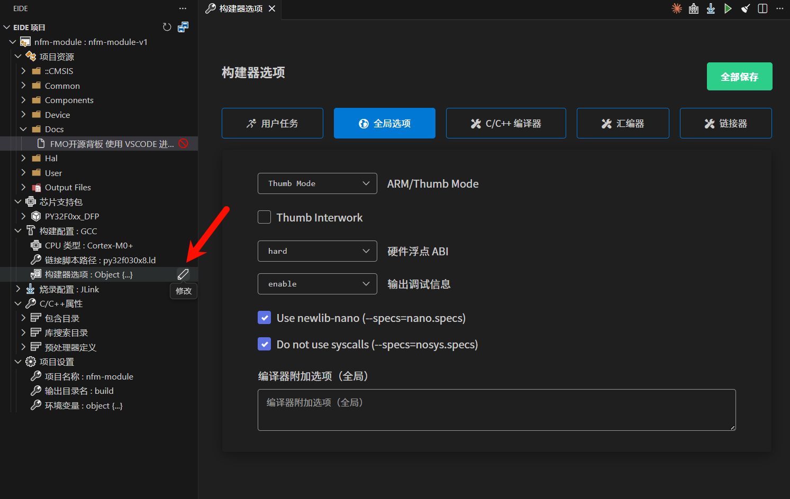

# FMO开源背板 使用 VSCODE 进行编程调试瞎逼逼

## VS Code编程调试方案

### 方案：采用EIDE插件+GCC工具链（推荐）

本项目已配置好EIDE-GCC开发环境，使用GNU Arm Embedded Toolchain进行编译。你只需要安装必要的工具，然后打开工作区即可开始编程调试。

#### 前期准备

1. [VS Code](https://code.visualstudio.com/)
2. GNU Arm Embedded Toolchain（通过EIDE插件安装）
3. 一台Windows电脑（也支持macOS和Linux，但本文以Windows为例）

#### 安装阶段

请根据实际情况调整任务起点

1. 安装VS Code
2. 安装[EIDE插件](https://marketplace.visualstudio.com/items?itemName=CL.eide)
3. 安装[Cortex-Debug插件](https://marketplace.visualstudio.com/items?itemName=marus25.cortex-debug)
4. 依次打开`操作`-`安装实用工具`

5. 安装以下工具：
   - Cppcheck（代码静态分析）
   - **GNU Arm Embedded Toolchain（必须安装）**
   - OpenOCD Programmer（调试器）
   - Jlink（可选，用于J-Link调试）

6. 安装完毕后按照提示重启VS Code

   

7. **打开工作区**：
    - 在VS Code中，选择`文件`-`打开文件夹`
    - 导航到本项目根目录下的`eide`文件夹并打开
    - 系统会自动加载EIDE项目配置

   

8. **配置J-Link调试环境**：由于调试配置文件（`.vscode/launch.json`）已在`.gitignore`中排除，需要手动配置调试环境。

   1. **添加PY32F0芯片支持到J-Link**：
      - 参考[官方指南](https://py32.org/tool/PY32_JFlash_Plugin.html#介绍)，将PY32F0系列芯片的设备描述文件添加到J-Link目录
      - EIDE安装的J-Link路径：`${userHome}/.eide/tools/jlink`

   2. **配置VS Code调试**：
      - 打开左侧的`运行和调试`面板（Ctrl+Shift+D）
      - 点击`创建一个launch.json文件`
      - 选择`工作区`
      - 选择`更多Cortex-Debug选项`
      - 选择`Debug: J-Link`

      

   3. **调试配置已预置**：
      - 项目已包含基本的调试配置模板
      - 启动调试时，系统会自动加载正确的配置

9. **开始使用**：
   现在你可以：
   - **编译项目**：按`Ctrl+Shift+B`或点击底部状态栏的编译按钮
   - **烧录程序**：在EIDE插件界面选择J-Link作为烧录器
   - **启动调试**：按`F5`键开始调试会话

> **注意**：项目已预配置为GCC工具链，无需额外设置。如需了解如何从MDK工程导入或配置GCC工具链，请查看附录。

## 附录

### 1. 导入MDK工程到EIDE

如果你需要从头开始创建EIDE项目，可以按照以下步骤导入现有的MDK工程：

1. 在`操作`-`安装实用工具`中选择安装 AC6 编译环境并根据提示重启插件

   
2. 在VS Code中，依次选择`导入项目`-`MDK`-`ARM`
3. 找到并打开MDK工程文件(`/project/nfm-module.uvprojx`)
4. 依次选择`安装CMSIS芯片支持包`-`From Disk`，在弹出的文件资源管理器页面找到芯片支持包(`/docs/Puya.PY32F0xx_DFP.1.1.7.pack`)

   

5. 依次选择`选择芯片`-`PY32F030x8`

   

6. 完成导入后，项目默认使用AC6工具链

### 2. 配置GCC工具链

将项目从AC6切换到GCC工具链的步骤：

1. **切换工具链**：
   - 在EIDE项目资源管理器中，右键点击项目名称
   - 选择`项目属性`-`工具链`
   - 将工具链从`AC6`切换为`GCC`
   - 确认链接脚本文件已设置为`py32f030x8.ld`
   - 修改启动文件路径，从`/common/startup_py32f030xx.s`（AC6版本）改为`/eide/startup_py32f030xx.s`（GCC版本）

   

2. **配置编译选项**：
   - 由于是从AC6迁移至GCC，故大部分编译选项已自动适配。

   - 如需修改，请从构建配置-编译器选项中进入修改。

   

3. **验证配置**：
   - 编译项目，确认没有错误
   - 检查生成的ELF文件大小和内存布局

---
更新时间：2025年12月16日